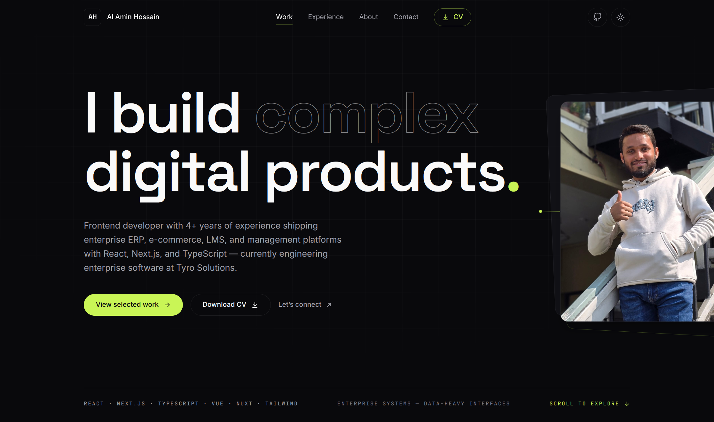

# Al Amin Hossain — Personal Portfolio

Production portfolio website for **Al Amin Hossain**, Frontend Developer (React · Next.js · TypeScript).

**Live:** https://alamindevms.github.io/portfolio/



## Tech Stack

- **React 19** + **TypeScript** (Vite)
- **Tailwind CSS v4** — token-based design system with dark/light themes
- **GSAP** + ScrollTrigger — entrance timelines, scroll reveals, subtle parallax
- **SSG** — React prerendered to static HTML at build time, hydrated on the client
- Zero runtime dependencies beyond React and GSAP

## Features

- Recruiter-focused single-page narrative: hero → selected work → experience → strengths → stack → AI workflow → about → contact
- Dark/light mode with system-preference detection, `localStorage` persistence, and no flash on load
- Full `prefers-reduced-motion` support — all animation disabled, content never hidden
- Accessible: semantic HTML, keyboard navigation, focus states, skip link, ARIA labels
- SEO: Open Graph / Twitter cards with generated 1200×630 social image, JSON-LD Person schema
- Works over `file://` — relative asset paths, prerendered content, no-CORS stylesheet

## Getting Started

```bash
npm install       # install dependencies
npm run dev       # start dev server
npm run build     # typecheck + build + SSG prerender → dist/
npm run preview   # serve the production build locally
npm run lint      # ESLint
npm run deploy    # build and push dist/ to gh-pages
npm run og:image  # regenerate the social share image from the hero photo
```

## Deployment

Pushing to `main` triggers the GitHub Actions workflow (`.github/workflows/deploy.yml`):
`npm ci` → `npm run build` → `dist/` published to the `gh-pages` branch, served by GitHub Pages.

## Project Structure

```
├── public/              # static assets (CV, favicon, OG image)
├── scripts/
│   ├── prerender.mjs    # SSG: injects rendered markup into dist/index.html
│   └── generate-og-image.mjs
└── src/
    ├── assets/          # hero image
    ├── components/      # layout / sections / ui primitives / visuals
    ├── data/            # profile, projects, experience, skills — edit here
    ├── hooks/           # gsap helpers, theme, active section
    └── lib/             # gsap setup
```

Site content (projects, experience, skills, links, CV URL) lives in `src/data/` and can be updated without touching UI components.
